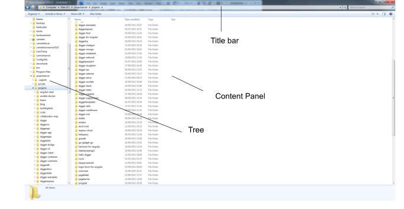
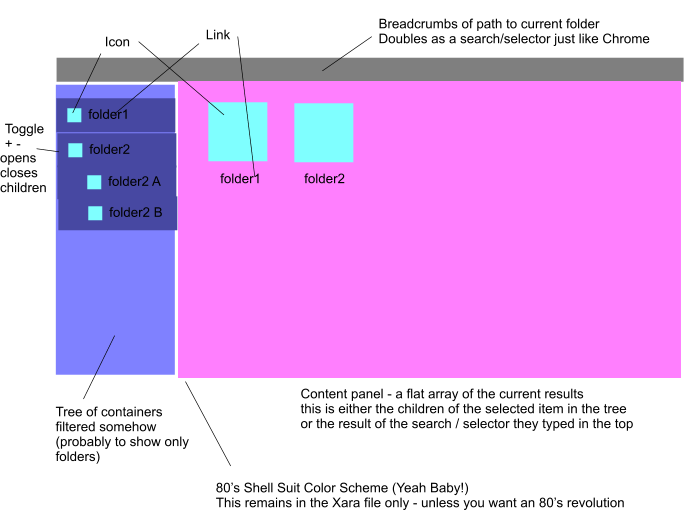

digger-folders
==============

An angular js folder viewer for digger databases

##Lets get jiggy

The humble beginnings for what will become the seminal and industry defining - digger interface.

### where we are ripping off the idea from

Windows Explorer - Mac Finder - Old Filing Cabinets with REAL folders and REAL paper files.

People just LOVE to put stuff inside stuff.



### what we want roughly

We want to take the idea of files and folders and create a basic GUI from it onto digger databases.



(p.s. loose the color scheme)

##Code

We want a resuable component written in Angular that we can throw all over the place.

It should have [Bootstrap](http://getbootstrap.com/) HTML markup so it can be themed by the users bootstrap.css.

### Data Structure
We need to be able to give the $scope some data looking this this (classic digger data):

```json
{
	"name":"Folder",
	"_digger":{
		"diggerid":"123"
	},
	"_children":[{
		"name":"Child 1",
		"_digger":{
			"diggerid":"456"
		}
	}]
}

```

So - each 'container' has a name, id and _children.

It is best to mock up the whole thing using dummy raw data.

The less dependencies the better.

We might come out of this with a useful windows explorer for EVERYONE not just digger databases.

Point is - work with the data structure above and that makes it a sinch to diggerize from above : )

### Components
Using this we can make a tree - a content view and a title bar with breadcrumbs.

There are 3 directives:

 * Tree
 * Content View
 * Title Bar

These can emit events and so we can decide and implement 'what happens if I click the tree' etc afterwards (as it will be different for each context each use the folders for).


### Existing Code
There is a badly done version of this rough idea in the [old diggerdubs](https://github.com/webkitltd/diggerdubs/tree/master/oldone) repo.

I've extracted the parts of interest and moved them into the reference folder here:

#### database.html / database.js

The horrible Phat Controller that was the core of the app.  This understands loading a digger database - clicking on the tree, digging down into folders and a whole bunch besides.

It has the concept of 'selection' - can cut, copy paste and do a whole bunch of other shit.

However - all of these things are stuffed up those 2 files (BAD) and so this is the beggining of the 'doing it properly' phase.

#### tree.js

This is the tree directive from [digger-for-angular](https://github.com/binocarlos/digger-for-angular).

It should not be in digger-for-angular (which is just about warehouses and selectors and render values).

So - you can use none / some / all of this file - I did some googling about recursive ng-repeat and that is what I came up with : )


